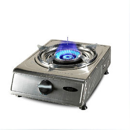
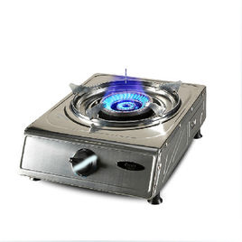
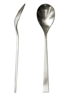

## 材米油盐酱醋茶，一点一滴都是幸福在发芽

#### 材料准备

- 食盐、食用油、酱油、耗油、味精（可选）
- 一口锅、锅铲、装菜的盘子、试吃的筷子、一个塑料杯、一个普通勺子
- 葱、蒜头（看自己需要）

#### 开火

注意开火前调料要拿远一点，防止油碰倒与煤气共燃

- 一开始开火至大火等油烧红放蒜头爆香，然后放菜翻炒

   

- 翻炒20-40秒（每5秒翻炒一次），然后调至中火

  

- 盖好锅盖，焖15秒翻炒一次，焖2-3次（菜熟了即可，不熟继续焖）
- 加调料如下 **用量** 所述
- 加好了调料，小火翻炒至调料溶解均匀（很快大概10秒）
- 最后关煤气，装菜
- 吃完记得洗锅、洗碗

#### 用量(少了就加，不是固定的量)

不喜欢的就不加

- 食盐半勺（普通勺子）

- 耗油（一勺）

- 味精（1 / 4勺）

  

- 食用油半杯

- 酱油（杯底 至 酱油面 1cm高）

  

  

